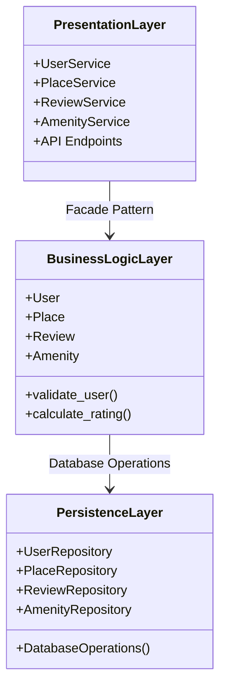
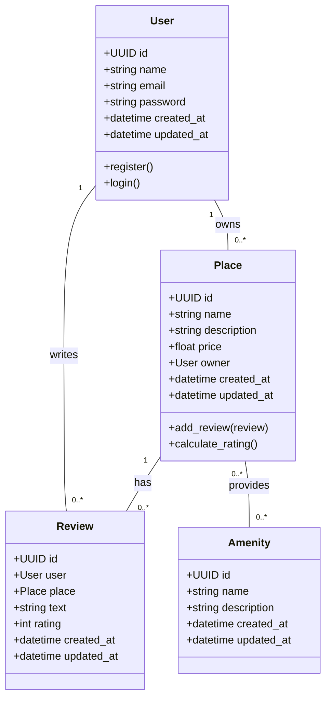
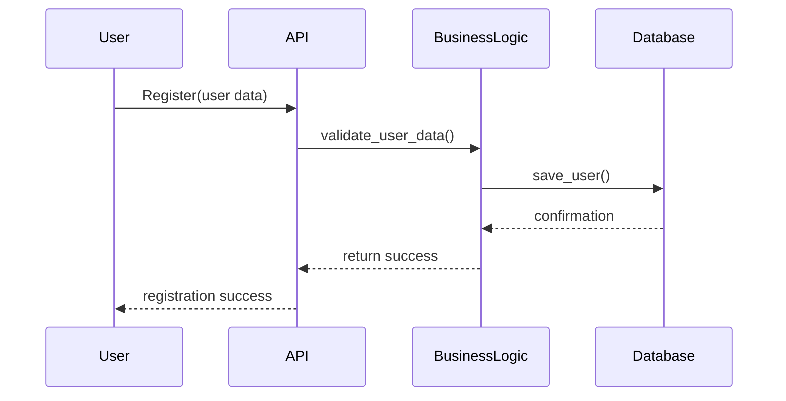
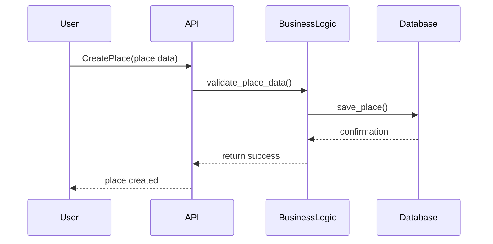
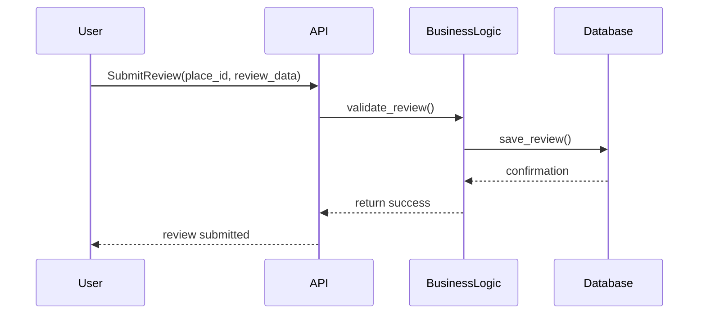
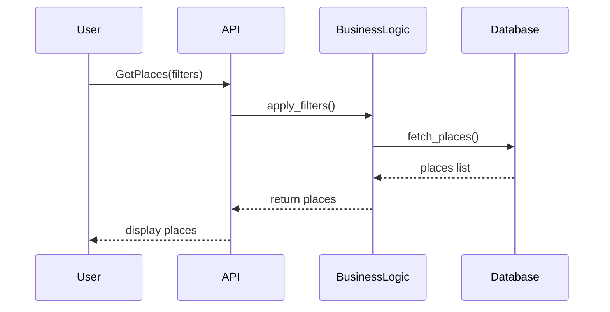

# HBnB Project Diagrams

This file contains all diagramms for HBnb Project!
---

## 1️⃣ High-Level Package Diagram

## 2️⃣ Detailed Class Diagram

## 3️⃣ Sequence Diagram(User Registration)

## 3️⃣ Sequence Diagram(Place Creation)

## 3️⃣ Sequence Diagram(Review Submission)

## 3️⃣ Sequence Diagram(Fetching a List of Places)

