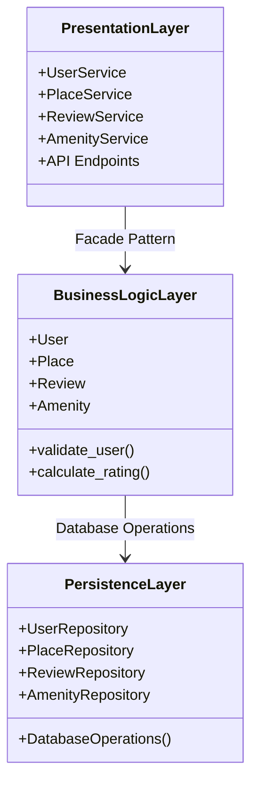
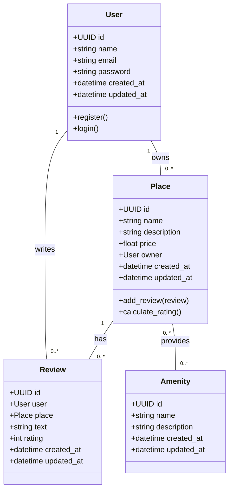
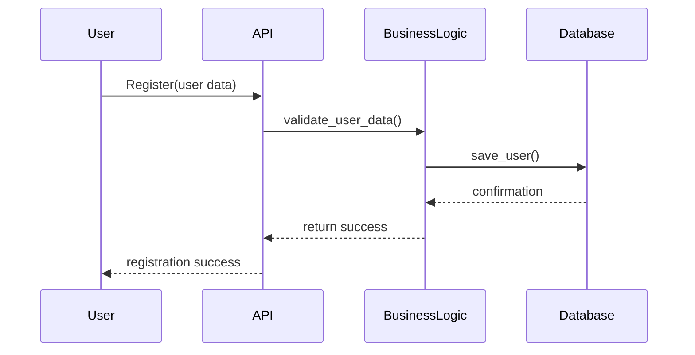
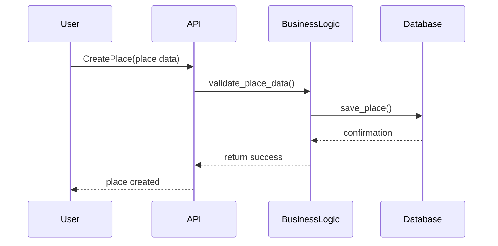
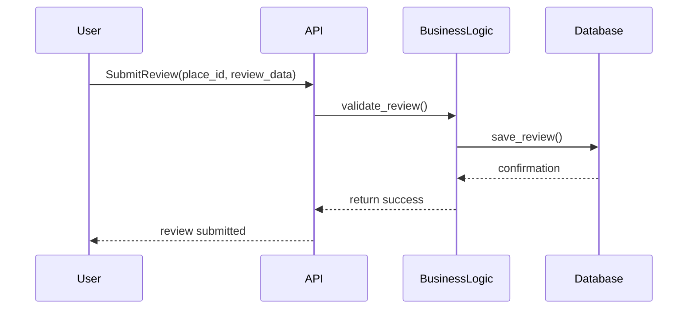
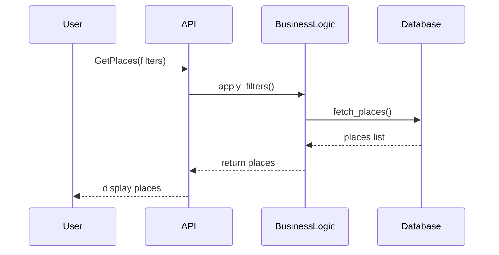

# HBnB Project Diagrams

This file contains all diagramms for HBnb Project!
---

## 1️⃣ High-Level Package Diagram

This diagram shows the **three-layer architecture** of the HBnB application.  
It includes the Presentation Layer (services & API), the Business Logic Layer (models), and the Persistence Layer (database interactions).  
The layers communicate via the **Facade Pattern**

## 2️⃣ Detailed Class Diagram

This diagram represents the entities in the Business Logic Layer.
It shows User, Place, Review, and Amenity classes with their key attributes, methods, and relationships:

- Users own Places
- Users write Reviews for Places
- Places provide multiple Amenities

## 3️⃣ Sequence Diagram(User Registration)

This diagram shows the flow of registering a new user:

- User sends registration data to API
- API validates the data via Business Logic Layer
- Business Logic saves the user in the Database
- Confirmation is sent back through API to the User

## 3️⃣ Sequence Diagram(Place Creation)

This diagram illustrates creating a new place listing:

- User submits place details
- API passes it to Business Logic for validation
- Business Logic saves it to Database
- Confirmation is returned to the User

## 3️⃣ Sequence Diagram(Review Submission)

This diagram shows how a user submits a review:

- User submits review for a place
- API forwards it to Business Logic for validation
- Business Logic saves the review in the Database
- Confirmation is returned to User

## 3️⃣ Sequence Diagram(Fetching a List of Places)

This diagram shows how the application fetches a list of places:

- User requests a list with filters
- API forwards the request to Business Logic
- Business Logic fetches data from Database
- List of places is returned to User via API

